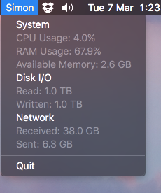
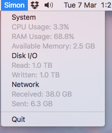

# Simon

Simple macOS menubar system monitor, written in Python3.6 + pyobjc.




Only tested on **macOS Sierra 10.12.3**.

## Installation & Usage

Simon depends on `pyobjc` and `psutil`.

```
$ git clone https://github.com/hcyrnd/simon.git
$ cd simon
$ virtualenv .venv && source .venv/bin/activate
$ pip install -r requirements.txt
$ python simon.py
Simon is now running.
CTRL+C does not work here.
You can quit through the menubar.
```

To run Simon in the background, use `nohup`:

```
$ nohup python simon.py &
```

To quit Simon, quit through the menubar.

## Why?

I made this primarily for learning purposes, and because I couldn't find a menubar system monitor that is similar and simple enough showing only the information I want.

## Todo

* More stats - battery, temperature, etc.
* Measure impact on system resources
* Preferences/settings: allow user to set update interval, etc.
* Standalone .app
* ...

## License

MIT